算是第一次參加AIS3 這次解出8題 不含Welcome

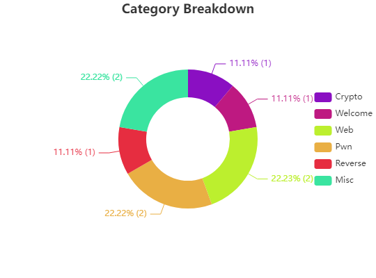

Crypto題型

1. SC

基本上是水題，給出enc和原code馬上就知道是將字替換掉

將flag的enc拉到最後一行可以很明顯的知道這就是flag

5xvJ{IVnCDwT\_I24t6W626DVw\_ODPzJi\_FDMz\_awVFw\_PWmDw6J86\_m66cOa}

對應到

AIS3{s0lving\_sub5t1tuti0n\_ciph3r\_wi7h\_kn0wn\_p14int3xt\_4ttack}

Misc題型

1. Excel

載下來一個xlsm，一開始的思路是裡面可能有藏東西，因此用binwalk來看，發現有很多資料在裡面

在這裡面糾結了很久，最後發現也是水題，用Excel打開後就有提示說是否啟用巨集

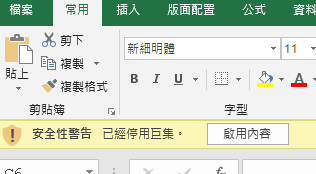

想到說可能直接執行巨集跑，逐行執行後發現flag

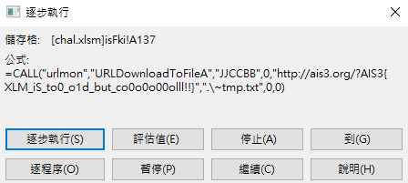

1. Gift in the dream

載下來是個gif檔，一開始用Convert拆掉，看了一下大約50張圖組成，再用Stegsolve分析，但好像沒有隱藏圖片

想說用strings看看，結果發現有提示

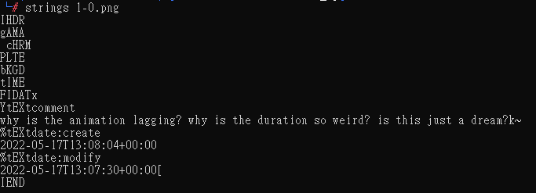

提到了animation lagging，再想到有CTF是利用gif每張圖片的間隔來寫flag的

就用identify看看時間，果然看到65 73 83 51，直接就知道是ascii的AIS3

Reverse題型

1. Time Management

Reverse題型，先跑一次程式看看

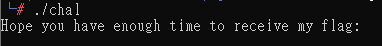

發現一直卡在這邊

接著丟到IDA Pro看看，第一個想法是讓程式直接跳到flag那邊

跳過去的是126B，就將jle無腦改成jge試試看

發現程式直接結束了

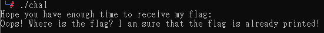

好吧要認真看了

發現Text有一個看起來像flag的東西

結果送失敗QQ他顯示使用strings 但能看到這個通常這句話也沒什麼幫助QQ

接著看到20B0

看到%c感覺起來他的flag在程式執行的時候 是有被一個一個字元輸出出來的

這邊也有提示說跟time有關

接著就找跟time有關的，發現0x 1230有call sleep function，而前面帶的參數是0x8763等於要跑9個小時才sleep完，看來這個就是答案了

將秒數改成1

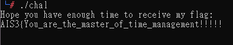

Web題型

1. Simple File Uploader

基本上進去就一個上傳檔案的Service

看了一下source code發現副檔名擋一堆

然後檔案內容也是擋一堆

副檔名的話 繞過很簡單，因為已經限定字串了，因此用phP就能繞過

檔案內容想了很久，最後想到能用<?php $\_GET['a']($\_GET['b']);?>來繞過

就upload上去，發現upload成功，沒有被擋下來

接著到上傳的路徑

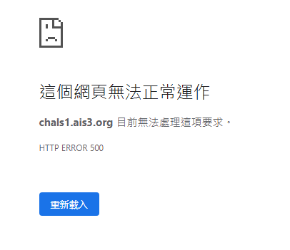

感覺應該成功了

接著就是?a=system&b=ls /

whoami

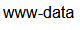

可以開始找flag了

有一個das\_ist\_die\_fL4g.txt發現cat不到ls -la才發現是權限不夠

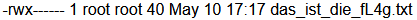

就先把目光轉到rUn\_M3\_t0\_9et\_fL4g再說，畢竟跑他的權限是夠的

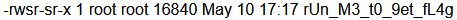

?a=system&b=../../../../../rUn\_M3\_t0\_9et\_fL4g

結束

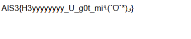

1. Poking Bear

一開始的想法就是先看F12能不能點SECRET BEAR

但看起來就算開啟也點不進去

接著就把全部的Go poke him ! 點開就能發現第一個分頁是/bear/5 第二個是29 接著是82、327、350、777、999

不能點擊的SECRET BEAR卡在350跟777中間

找到是499不一樣

對499 Poke! 一下，發現跳出我不是bear poker

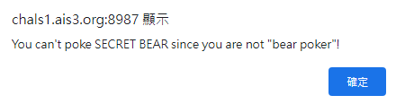

看到這個基本上就知道是吃Cookie

把Cookie當中的human參數改成bear poker後拿到flag

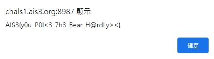

Pwn題型

1. SAAS - Crash

載下來後發現並沒有任何call bin/sh之類的function，既然是40分的題目應該是水題，直接連上去發現可以新增跟查看，總之塞爆就對了，不斷的新增和查看最後就會吐出flag了

1. BOF2WIN

看題目就知道overflow到某個地方就好

先看checksec

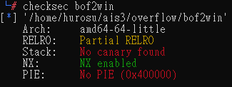

打開載下來的bof2win.c檔可以知道要跳到get\_the\_flag()這個function，所以有NX保護也沒差

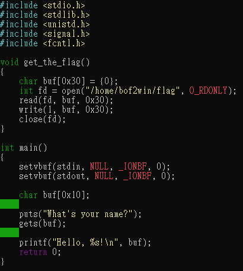

可以看到gets的buffer只有16

其實這邊根據以往的經驗其實可以大概猜得出來了，但還是gdb一下，因為沒裝peda所以先用pwntools的cyclic

Segmentation fault後看暫存器

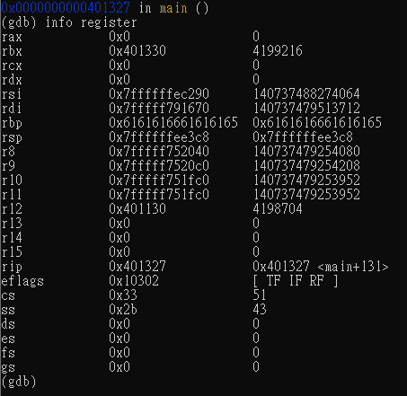

從cyclic可以知道到壓到rbp是20因此壓完rbp是24

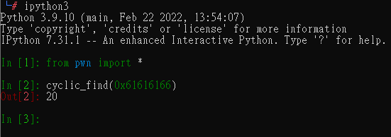

接著看get\_the\_flag的address

所以payload就有了

送出去 get flag ~

